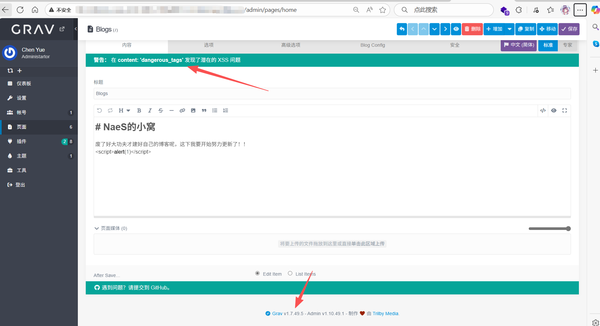
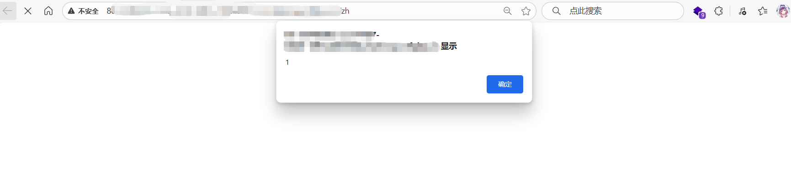

#  CVE-2025-63593

涉及框架：Grav

涉及版本：1.7.49.5

Release：[Release 1.7.49.5 · getgrav/grav](https://github.com/getgrav/grav/releases/tag/1.7.49.5)

虽然做了警告，但是并没有阻止

访问首页可以被成功触发

潜在危险：

- 可能窃取用户信息
- CSRF攻击
- ....