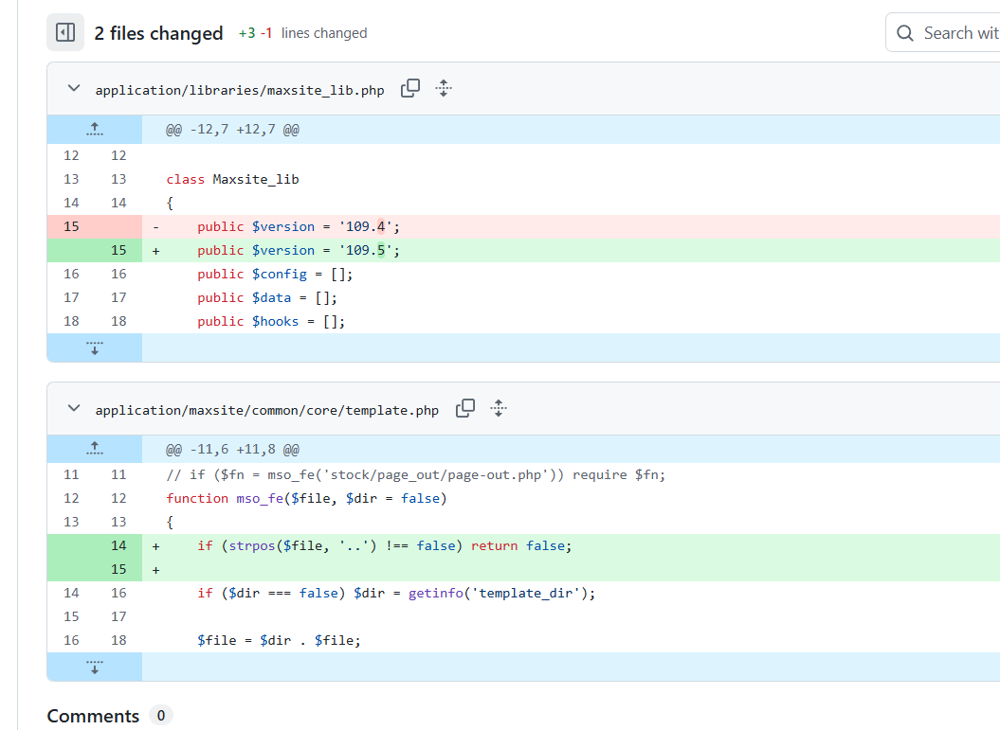

# README

回信：

```email
Hello!

MaxSite CMS implements a Flat Trust Model for all users with access to
the admin panel.

The division into roles (Admin/Editor) is intended for interface
convenience and workflow organization, not to create security barriers.
Any person allowed to access the admin panel is a priori considered a
fully trusted entity.

Since the system ensures 100% isolation of public users from the admin
panel, this case does not constitute a Security Boundary Cross (SBC)
violation. Therefore, it does not qualify as a CVE vulnerability. The
character filtering errors have been fixed as part of the workflow
(MaxSite CMS version 109.5).

Thank you for your work!

13.04.2026 16:34, Wlx Children пишет:
```

当天已修复可能的目录穿越：



PS：尽管我仍认为既然admin可以指定user的所有功能，那么“被限制的user能通过其行为能创建新的admin并可能会对原有的管理体系造成一定破坏”就算是一种越权